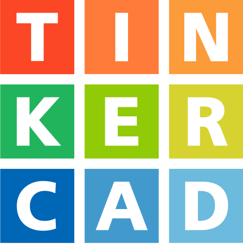

<h1 align="center">Hi 👋, I'm Felipe Przysiada</h1>
<h3 align="center">Teacher and Computer Engineer</h3>

&nbsp;&nbsp;
&nbsp;&nbsp;
&nbsp;&nbsp;
&nbsp;&nbsp;

I'm a 32 years old Teacher at Universidade Positivo. Computer Engineering graduated and Master at Eletrical Enginnering.

   

### Curiosities

🇧🇷 Living in [Curitiba](https://www.google.com/maps/place/Curitiba,+PR/@-25.4950501,-49.4298839,11z/data=!3m1!4b1!4m5!3m4!1s0x94dce35351cdb3dd:0x6d2f6ba5bacbe809!8m2!3d-25.4289541!4d-49.267137), Brazil

  ---

### Languages

  
  
  
  
  

### Databases

  

### Dev Tools

  
  
  
  
  
  

### Embedded and IoT

  
  
  
  
  
  
  
  

### Management

  
  

  ---

### Certifications
